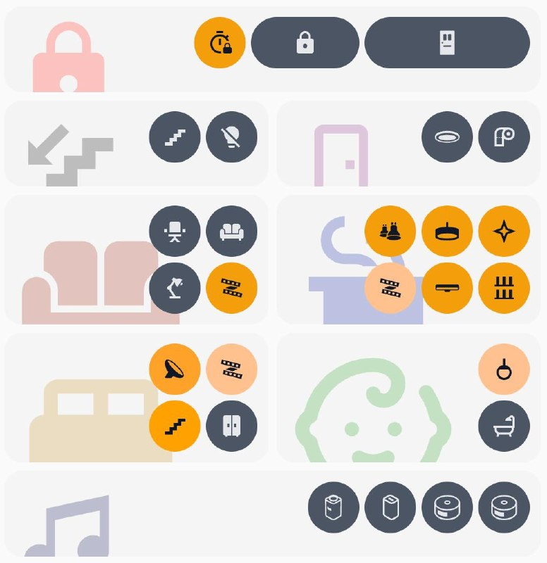

# ha-seagull-room-card

Home Assistant custom card: `custom:seagull-room-card`.



## Features

- Compact room card with configurable icon, text and button grid
- Flexible button collections (`entities`, `items`, `button`, `buttons`; `lights` alias supported)
- Smart visibility (`show*`) + `keep_spot` to preserve layout when hidden
- Theming with day/night palette and `$palette_key` references
- Domain-aware defaults (e.g. `sensor` / `binary_sensor` default to `more-info` actions)
- Action system: `toggle`, `more-info`, `navigate`, `perform-action`, `sequence`

## Installation

### Option A — HACS (recommended)

1. HACS → **Frontend** → **⋮** → **Custom repositories**
2. Add: `https://github.com/avchaykin/ha-seagull-room-card`
3. Category: **Dashboard**
4. Install **Seagull Room Card**
5. Add Lovelace resource:
   - URL: `/hacsfiles/ha-seagull-room-card/seagull-room-card.js`
   - Type: `JavaScript Module`

### Option B — Manual

1. Copy files to HA:
   - `/config/www/seagull-room-card.js`
   - `/config/www/seagull-room-card-loader.js`
2. Add Lovelace resource:
   - URL: `/local/seagull-room-card-loader.js`
   - Type: `JavaScript Module`

## Minimal config

```yaml
type: custom:seagull-room-card
buttons:
  entities:
    - entity: light.living_room
```

## Actions

Supported action types:
- `toggle`
- `more-info`
- `navigate`
- `perform-action`
- `sequence`

### Example: sequence

```yaml
tap_action:
  action: sequence
  sequence:
    - action: perform-action
      perform_action: light.turn_on
      target:
        entity_id: light.kitchen
    - delay_ms: 300
    - action: more-info
```

Notes:
- `sequence` can be used as `action: sequence` or as `sequence:` inside any action object
- Delay steps support `delay_ms`, `delay`, or plain number (milliseconds)

## Key config blocks

### Card-level

- `entity` (optional default entity for templates/actions)
- `icon`, `icon_color`, `icon_size`
- `background_color`, `background_opacity`, `border_radius`, `border_width`, `border_color`
- `tap_action`, `double_tap_action`, `hold_action`
- `variables`, `text`, `buttons`, `theme`

### Text

- `text.entity`, `text.value`
- `text.color`, `text.background_color`
- `text.size`, `text.halign`, `text.valign`
- `text.padding*`
- `text.tap_action`, `text.double_tap_action`, `text.hold_action`

### Buttons (layout + defaults)

- Layout: `cols|columns`, `rows`, `size`, `gap`, `padding*`, `align`
- Collections: `buttons.entities|items|button|buttons` (array/object), `lights` alias
- Default style: `icon`, `color`, `background`, `border`, `border_color`, `border_radius`
- Dynamic behavior: `use_light_color`, `invert_state`, `obsolete`
- Visibility: `show`, `show_value`, `show_not_value`, `show_above`, `show_below`, `keep_spot`
- Default actions: `tap_action`, `double_tap_action`, `hold_action`

### Per-button fields

- `entity` (optional if icon-only)
- `width`
- `icon`, `color`, `background`, `border`, `border_color`, `border_radius`
- `empty` (explicit blank slot)
- `tap_action`, `double_tap_action`, `hold_action`
- `show*`, `keep_spot`, `invert_state`, `obsolete`

## Theme and palette

`theme` supports:
- `theme.palette_mode`: `auto | day | night`
- `theme.palette` with named values (string or `{day, night}`)
- `theme.card`, `theme.text`, `theme.button`

Use palette values via `$name`:

```yaml
buttons:
  background: "$seagull_rose"
```

Default theme schema is in: `seagull-room-card-theme-default.js`

## Domain defaults

- Active-state mapping:
  - regular domains: `state == on`
  - `lock.*`: `state == unlocked`
  - `media_player.*`: `state == playing`
- `sensor.*` and `binary_sensor.*` default actions:
  - tap / hold / double_tap = `more-info`

## Version

Card displays current version badge in editor and logs version in browser console.
