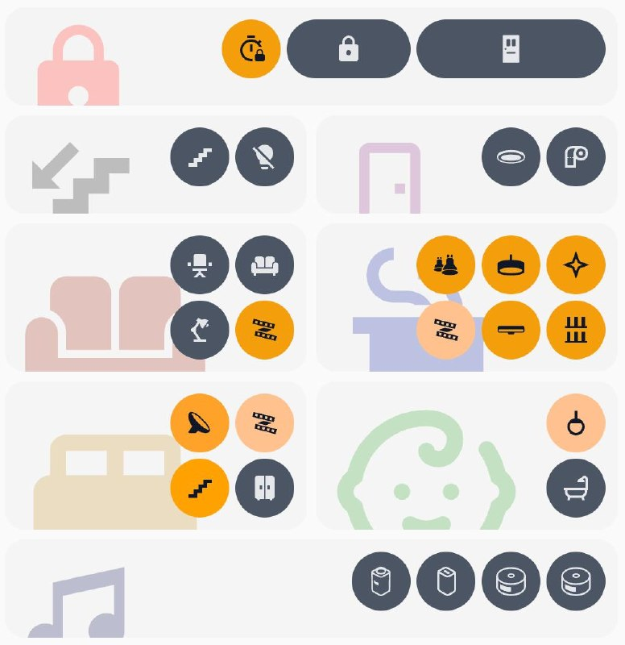

# ha-seagull-room-card

Home Assistant custom card: `custom:seagull-room-card`.



## What it does (short)

- Room card with top text block + button grid
- Flexible button definitions (`entities`, `items`, `button`, `buttons`, `lights`)
- Per-button style, width, visibility rules, actions
- Templates (`{{ ... }}` and inline text like `{{ states(entity)|round }}°C`)
- Theme system with palette + day/night mode

Full reference: **[DOCUMENTATION.md](./DOCUMENTATION.md)**

## Installation

### Option A — HACS (recommended)

1. HACS → **Frontend** → **⋮** → **Custom repositories**
2. Add: `https://github.com/avchaykin/ha-seagull-room-card`
3. Category: **Dashboard**
4. Install **Seagull Room Card**
5. Add Lovelace resource:
   - URL: `/hacsfiles/ha-seagull-room-card/seagull-room-card.js`
   - Type: `JavaScript Module`

### Option B — Manual

1. Copy files to HA:
   - `/config/www/seagull-room-card.js`
   - `/config/www/seagull-room-card-loader.js`
2. Add Lovelace resource:
   - URL: `/local/seagull-room-card-loader.js`
   - Type: `JavaScript Module`

## Minimal config

```yaml
type: custom:seagull-room-card
buttons:
  entities:
    - entity: light.living_room
```

## Card tap action: open external URL

You can attach a card-level `tap_action` in the root config. For external pages use `action: url`:

```yaml
type: custom:seagull-room-card
entity: light.living_room

tap_action:
  action: url
  url_path: https://example.com
  new_tab: true   # optional, default: true
```

Set `new_tab: false` to open the URL in the current tab.
